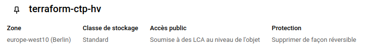

- [Questions Ouvertes 5 points](#questions-ouvertes-5-points)
  - [Création d'un Service Account :](#création-dun-service-account-)
  - [Création d'un Bucket :](#création-dun-bucket-)
  - [Gestion des droits (IAM) :](#gestion-des-droits-iam-)
  - [Configuration de la facturation :](#configuration-de-la-facturation-)
  - [Regles de vie :](#regles-de-vie-)
- [Les images](#les-images)
  - [Bucket](#bucket)
  - [DroitSA](#droitsa)

## Questions Ouvertes 5 points

### Création d'un Service Account :

● « Décrivez les étapes pour créer un Service Account dans GCP. Quelles sont les bonnes pratiques à suivre en matière de gestion des clés et de sécurité ? »
Pour créer un Service Account dans GCP, on se rend dans `IAM` puis `compte de service`, ici on  sélectionne `cree un compte de service`, on donne un nom puis on sélectionne uniquement les droits nécessaires a ce compte pour qu'il en ait le moins possible et qu'il puisse faire uniquement ce pour quoi il a été créer. Pour les cles on fait une cle json pas exemple que l'on stock dans une variable secrete pour quel ne soit pas accessible a tous.

### Création d'un Bucket :

● « Comment créer un bucket sur Google Cloud Storage ? Précisez les configurations importantes à définir (localisation, politique de conservation, etc.) et comment celles-ci impactent la sécurité et la performance. »
Dans GCP, on se rend dans `Cloud Storage` puis `Buckets`, on rentre un nom. Pour la configuration, l'emplacement est très important celui-ci va définir si l'on souhaite une disponibilité plus importante (Multi-region) ou une latence la plus faible possible (Region).
Concernant la classe de stockage cela permet de définir la qualité et redondance des informations (par exemple, il y a une grande différence entre des données d'archive et des données qui vont être modifier toutes les minutes.). On peut aussi sélectionner le niveau d'accès, soit global, soit au cas par cas. Pour finir on choisi comment sont protégés les données suppression réversible ou non, contrôlé de version et conservation pour empêcher la suppression. 

### Gestion des droits (IAM) :

● « En quoi consiste la gestion des identités et des accès (IAM) sur GCP ? Donnez un exemple concret de configuration des droits pour limiter l'accès à une ressource critique. »
L'IAM permet de définir ce que va pouvoir faire l'utilisateur ou le compte de service permettant alors de l'empêcher de faire certaines actions. Par exemple, en ne donnant uniquement l'accès Développeur Cloud Run à un compte, celui-ci ne pourra uniquement que consulte et modifier les instances Cloud Run existantes.

### Configuration de la facturation :

● « Expliquez comment configurer la facturation sur GCP. Quelles précautions recommanderiez-vous pour éviter des coûts imprévus lors du déploiement de projets ? »
Pour la facturation, on peut mettre en place un budget avec des alertes pour nous avertir quand certains sont atteints pour que l'on puisse réagir en conséquence.

### Regles de vie :

● « Quelle est la chose importante que l'on dit à la fin du cours en quittant la salle de TP ? »
Bonne journée, au revoir.

---

## Les images

### Bucket

### DroitSA
